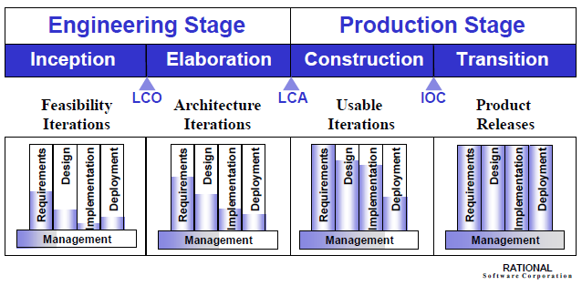

# Project Management for (project name)

This repo is designed to guide you in planning and managing the process of designing, building, and deploying a system-- either software, hardware, or a combination.

The guidance is based on the spiral process model developed by Barry Boehm. Page numbers used elsewhere in this repo refer to [this document](http://www.sei.cmu.edu/reports/00sr008.pdf).

The first three Issues in this repo will guide you through a process of stakeholder reviews that progress through the Anchor Point Milestones shown below.

The other Issues will guide you through an ongoing process of allocating resources and prioritizing tasks, based on assessment of project risks.
